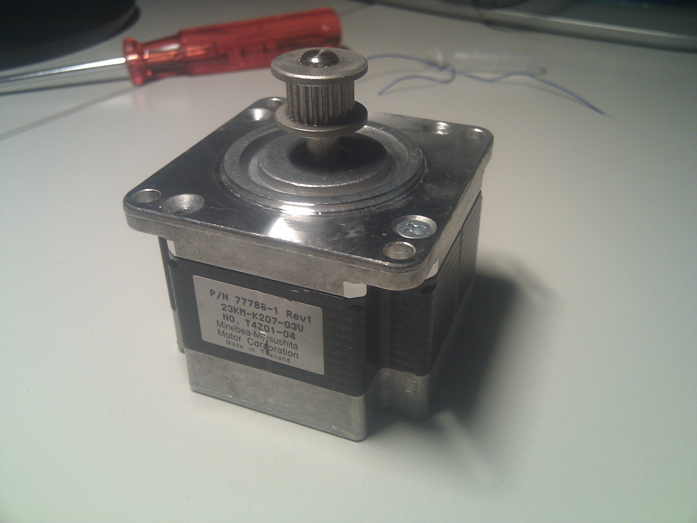
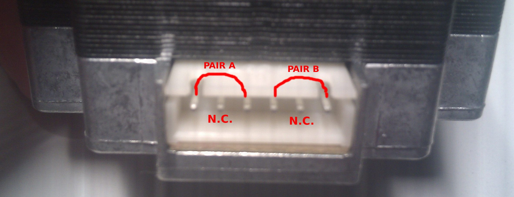

# Configuring Stepper motors
When you have spare 6 wire stepper motors from an untrusted source like me you need to understand what you could do with them. Each single motor (but this could be applicable to every mechanical device) has a natural lifecycle, it performs fine at the begin and it keeps an average efficiency until the end of its service period; after that it performs poorly (or out of its rating specs) until a mechanical failure. When its age or working hours are uncertain and when stress values are unknown you might be lucky or or not. I'll try to use them an see what I can do with this machine

## 6 Pin Wirings
I have 5 spare motors like this one

but I cannot get information from internet about their wirings, 6 wires steppers can be used as Bipolar motors and I have found the two pairs using [this method found on RepRap site](http://reprap.org/wiki/Stepper_wiring).
They appears to be NEMA23 motors so it might be possible to get some power and torque from them, for a Metal printer they should perform better when compared to generic NEMA17 devices.
Unfortunately I don't even have a proper connector for them and I'd like to adapt what I have around me, here are the two couples found with the Ohm Tester method described in the RepRap wiki:

## Shaping Connector
with a pair of three wires Dupont connectors I can create a six wire adapter, I already had them at home as service connectors, but you can easily find these from: your favorite electronics online store, farEast retailer (aliexpress, banggood, taobao, ...) or you may recover these connectors from old PC motherboards. For getting the right shape and give it some strength I also have added a scrap polycarbonate 2mm thin foil, here are my results:

I have used 1m Cat5 indoor belden cables without too much calculations on power and Amps passed on it. Hopefully they're good enough to carry required voltage and Amps, if not I'll surely recable these connectors with a thicker cable taken out from something else

## [Configuring RAMPS board connections](04.configuring.RAMPS.board.md)