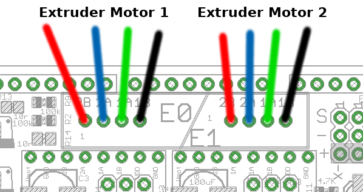
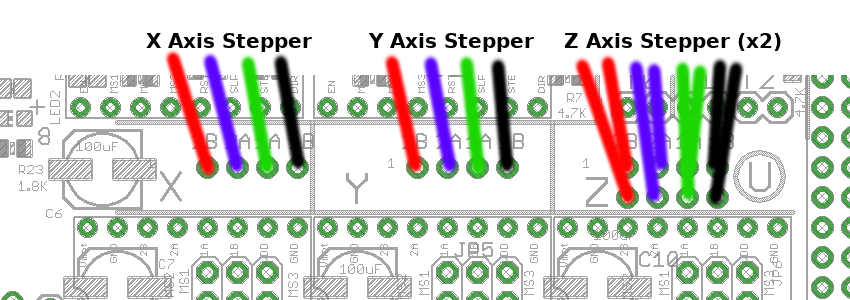
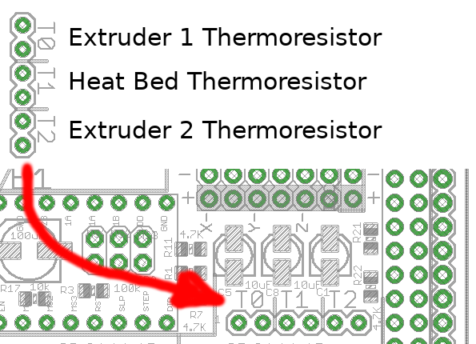
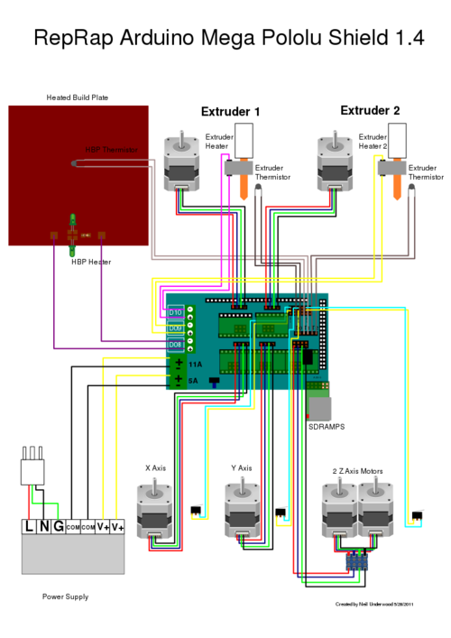

# Configuring RAMPS board
**WARNING:** _Turn off power and disconnect the USB cable before doing it._
<br/><br/>


and here is where all sensors must be conntected to get a working setup

## Extruder Motors


## X-Y-Z Axis Motors


## End Stop Sensors


## Thermoresistors connections


## Stepper Driver Boards
*Jumpers need to be installed under each stepper driver*
```
+-----------------+------------+
| Jumper  Yes/No  | Step Size  |
|  1     2     3  |            |
+-----+-----+-----+------------+
|  no |  no |  no |  full step |
| yes |  no |  no |  half step |
|  no | yes |  no |   1/4 step |
| yes | yes |  no |   1/8 step |
|  no |  no | yes |  1/16 step |
| yes |  no | yes |  1/32 step |
|  no | yes | yes |  1/64 step |
| yes | yes | yes | 1/128 step |
+-----+-----+-----+------------+
```
If the jumpers set it to a higher number of micro steps than supported by the driver it will operate at the maximum number of micro steps for that driver.
For now the default is maximum micro stepping (all jumpers installed under drivers), which results in 1/16 micro stepping for A4988 drivers and 1/32 for DRV8825. Although for efficiency and accuracy you should opt for the biggest steps that will yield sufficient resolution. Eg. you don't need 5000 steps per millimeter and [http://www.micromo.com/microstepping-myths-and-realities micro-steps] less than 1/16 have reduced torque per step, reduced accuracy and higher driver load].

Note: This can vary for different drivers.
1. Cut the pin headers to 8 pins long so that they fit each side of the stepper driver
2. Insert the pin headers into the sockets on RAMPS
3. Fit the stepper drivers onto the pin headers and solder. Only heat each pin for a few seconds at time to avoid damage to the socket
    - Glue the heatsink (if used) to the top of the [A4988] chip using the provided pad of double-sided adhesive


---
And here's the final result with an overview on all connections (original picture from RepRap website)
