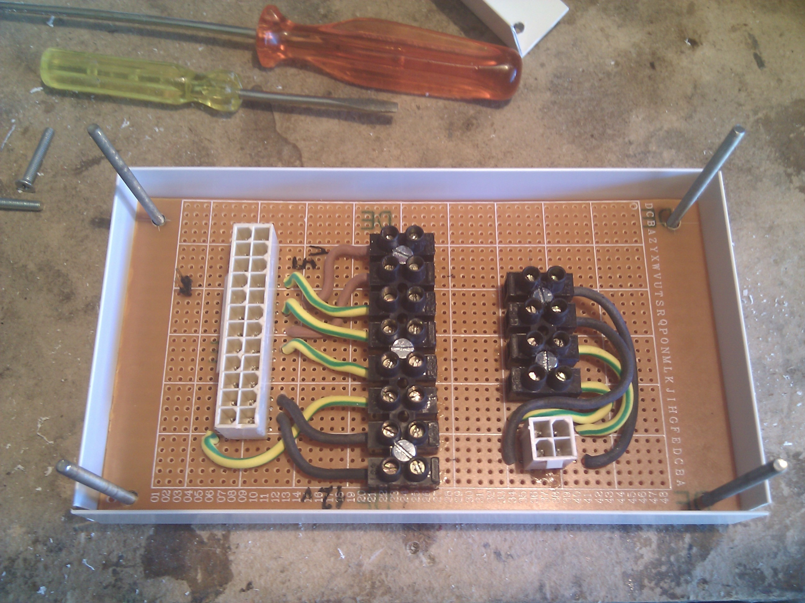
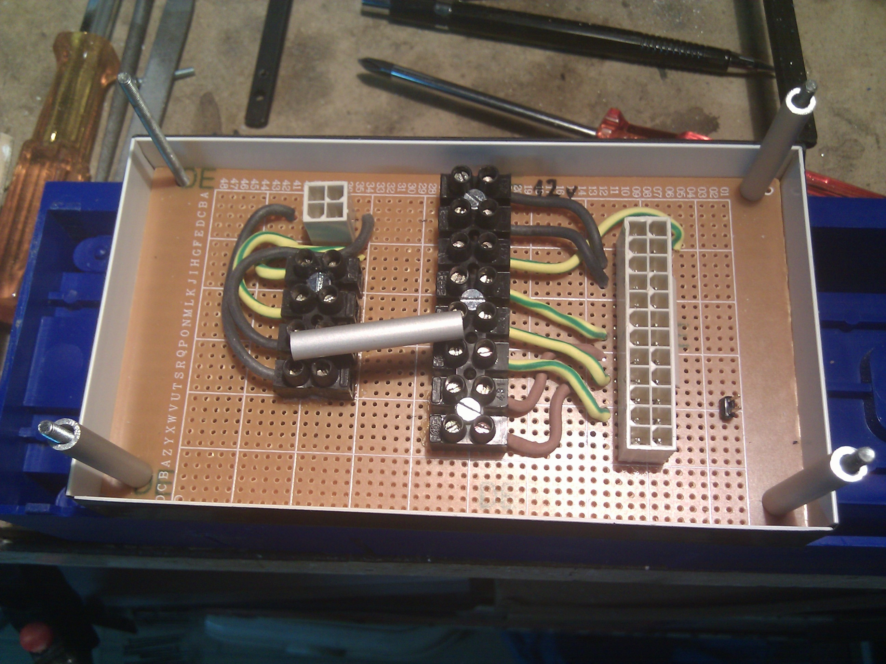
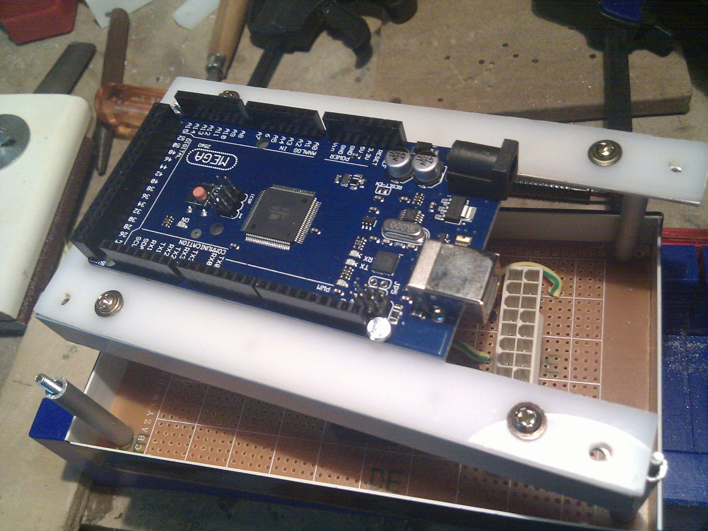

# Mounting the Electronics box
This open box will keep powerlines, arduino, RAMPS board and Raspberry Pi in the same place.
I don't have a ready made box and I don't have a design plan for it (yet). It's more a build in progress project, 
maybe I'll have a clean idea for that in the next release, this is just a prototype. 

- This perfboard has AT PSU connectors for getting an unmodified ATX power supply.
Jumper on the right is used for shorting PS_ON (green wire) with Ground (GND).
A 10&ohm; 10W ceramic resistor is applied between external 5V and GND on a separate Molex connector to keep a current
load so the PSU will stays always on. I have lean it to the PSU chassis to keep everything cool (it gets hot really fast).
On the back of the power supply there's a power switch, I'll use it to poweron/shutdown the machine.
I'm now using thick cables because I still don't know how many Amps I'll need for the steppers
(NEMA23 so I think I need a lot !). BTW: in this moment I only need 5V and 12V lines so I'll keep them up. Here's a preview

- With spare styrene angle squares and a polypropylene sheet I have built a 12x15 bowl to keep this perfboard,
I don't want to have it directly connected to the steel frame

- Basic mounting with 3mm nuts and bolts and. I don't clamp it hard because styrene breaks easily

- And here's my bowl. I have built it because I don't have something handy around me but I'll surely rework/reprint
that in the next version

- With a spare aluminium tube (inner diameter is 3mm) I have built these spacers to lay up the upper bridge with the arduino board

- Again: other spare aluminium and ABS plastic parts. ABS will held the arduino board, aluminium squares angles will give some
rigidity to the upper deck.

- Fixing Arduino ATMega to the upper deck

- Here're the components, everything is ready to be assembled

- Arduino on top and connected to the powerline board. The jack (+5V inside, GND outside) on the arduino board comes from the +5V/GND below.
Connection with the ATX PSU. 24pin and additional 4pin connector (+12V addon voltage) connected to the powerline. RAMPS shield has been
mounted on top of the Arduino but it's not connected to the voltage

