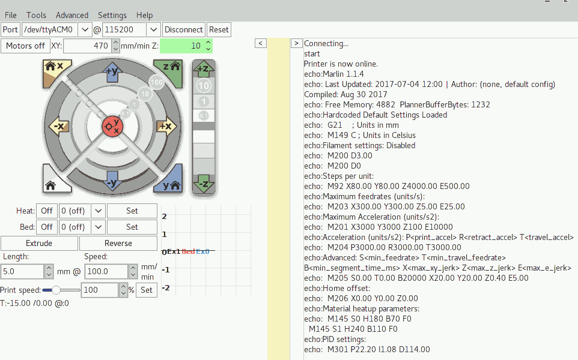
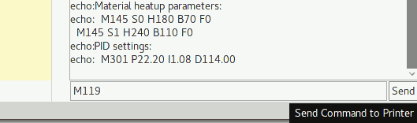

# Software Testing
After configuring the firmware as described in the [firmware file](firmware.md) it's time to understand if the whole system works, this page collects all software tests created for it. To speed up development and tests Arduino+RAMPS boards were connected to the desktop PC and Pronterface software where used. Pronterface is a bare minimum program but sufficient to do some basic tests with the machine, GUI is not that simple but quite confortable after a short while; install it on your workstation from your favorite repository or use a binary package from [official web site](http://www.pronterface.com/)

## PC Connection
**NOTE:** Close Arduino IDE if still opened or any other program using USB port connected to the Arduino+RAMPS board<br/>
- Open Pronterface program
- Select USB port on your PC with the combo box under the menu items
- Ensure to use 115200 as port speed
- Press the **Connect** button on the right
- If everything is fine you'll see something like what is shown in the image below


## Sending commands to the arduino board
To send a direct command to the machine just enter it on the right side text area and press the SEND button as show in this picture<br/>


## Create macros for repetitive commands
Under the yellow graph paper it's possible to create a macro command button in order to easily send repetitive commands to the machine, here's an example with EndStops checking<br/>


## Testing EndStop Sensors
Send command **M119** to the machine, if everything is fine this message will be shown
```
>>> M119
SENDING:M119
Reporting endstop status
x_min: open
y_min: open
z_min: open
```
With current NC (Normally Closed) setup this is what it should be shown, if something differs:
- Turn off the machine and check [EndStop hardware configuration](../electronics/04.configuring.RAMPS.board.md#end-stop-sensors)
- Double check endstops setup in the [firmware configuration.h file](./firmware.md#basic-tuning-bare-minimal-work)

## Testing Motors
If you don't know current resolution (mm/min) of your motors I'll suggest you to start with a barebone 50mm/min and go up until your motors work flawlessly, when you hear strange sounds or when motors are stalling it's better to get back and keep the last good known setup. After some tests I have found the current limit of 470 mm/min but I guess I'll keep an even lower value on production software